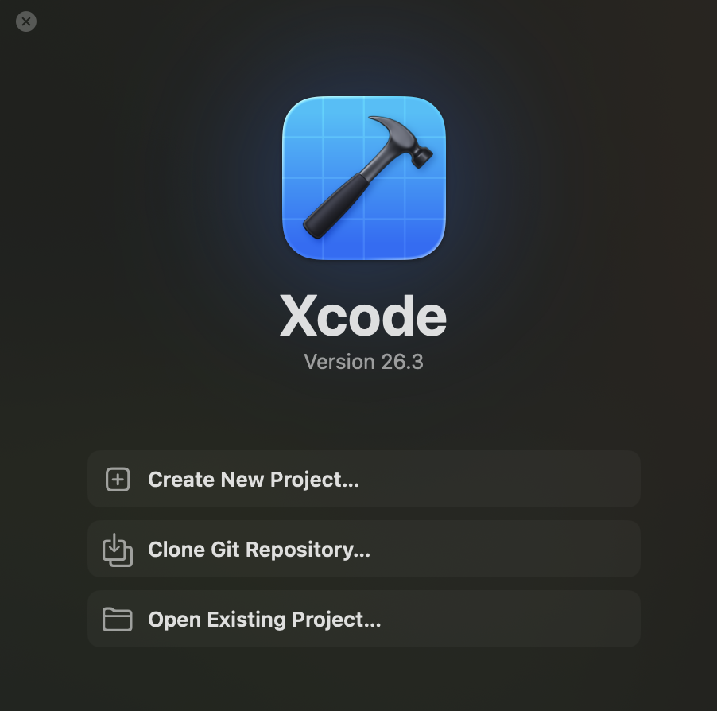
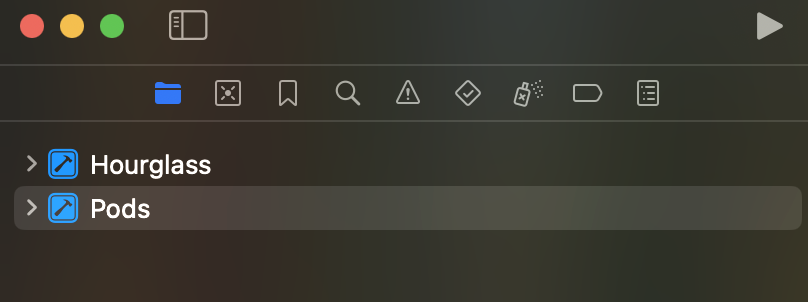
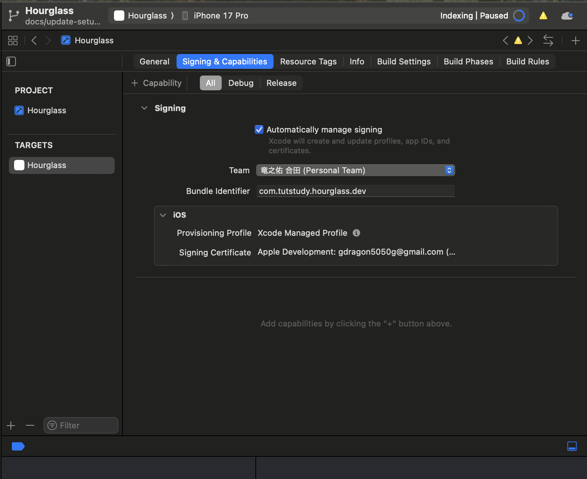
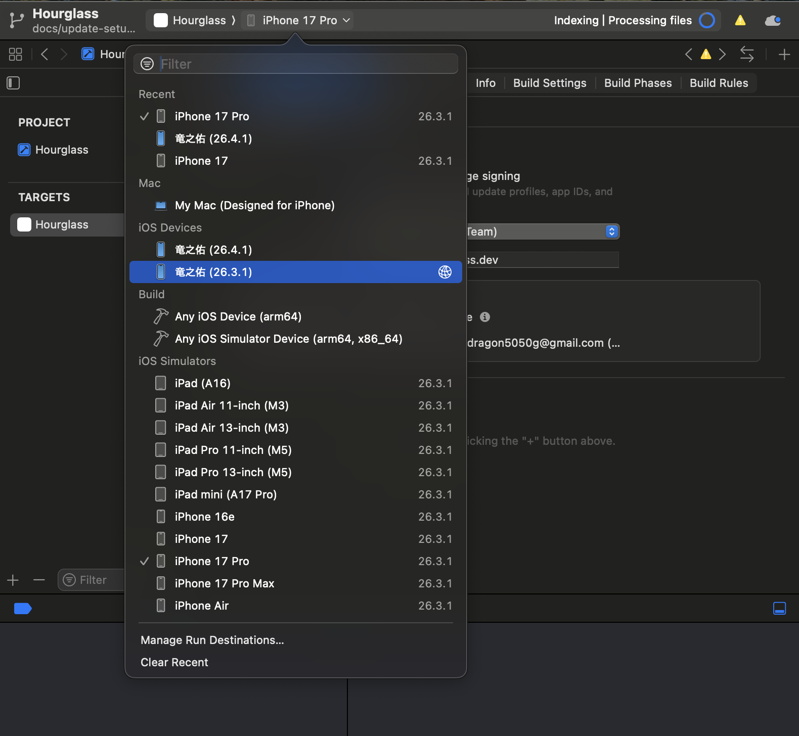

# 動作確認するまでのセットアップ

## 1. mobile側のセットアップ

コマンドはmobileディレクトリで実行

### 1-1. app.json を作成する

`mobile/app.json` は `apiBaseUrl` や `bundleIdentifier`など個人ごとに異なる値を含むため `.gitignore` 対象になっている。
初回 clone 時はテンプレートからコピーして作る。

```bash
cp app.json.example app.json
```

### 1-2. apiBaseUrlの編集

`ipconfig getifaddr en0` でアドレスを取得

app.jsonの中の`extra.apiBaseUrl` を書き換え

変更前
http://localhost:8080/api/v1

変更後
http://192.168.40.199:8080/api/v1

**これは接続しているwifiが変わるたびに変わるので注意**

### 1-3. bundleIdentifierの編集
exampleでは`com.hourglass-nomibress.app`となっている

真ん中の`hourglass-nomibress`を自分の名前に変えるのがおすすめ

### 1-4. ios ディレクトリを作成する

```bash
npx expo prebuild -p ios       # ios/ ディレクトリ生成
```

mobile直下にiosディレクトリがあることを確認

#### 1-4-a. CocoaPods の依存をインストールする(1-4.の失敗時のみ実行)

`prebuild` の末尾で自動実行されるが、失敗した場合や手動でやり直したい場合は以下を実行する。

```bash
cd ios
pod install
cd ..
```

- Apple Silicon (M1/M2/M3) で `pod install` が失敗する場合は `arch -x86_64 pod install` を試す
- CocoaPods が未インストールなら `brew install cocoapods` で導入する

### 1-5. 環境設定

依存を package-lock.json どおりに取得するコマンド

```bash
task install
```

### 注意事項

共有設定（`bundleIdentifier` / `plugins` / `experiments` など）を誰かが
更新した場合は `app.json.example` に反映される。手元の `app.json` にも
手動で差分を取り込むことを忘れないこと。

## 2. backendのセットアップ

全てのコマンドはbackendディレクトリで実行

### 2-1. 環境作成

依存をロックファイルどおりに取得する

```bash
task install
```

### 2-2. backend/.envファイルの作成

現状で加える変更はない

```bash
cp .env.example .env
```

## 3. dockerの起動

backend のローカル PostgreSQL は Docker Compose で起動する。

コマンド実行前にdocker desktopが起動していることを確認

実行場所は hourglass/backend

```bash
task db:up
task db:upgrade
```

実行後にdocker desktopでコンテナとイメージが作成されたことを確認

コマンドを実行して確認してもいい

```bash
docker ps
```

## 4. xcodeでの操作

xcode上で行う操作を写真付きで説明していくため、リモートリポジトリ上で見るかプレビュー表示することを推奨する

### 4-1. xcodeを開く

xcodeを開いた後画像一番下のOpen Existing ....を選択



フォルダ選択画面に進むので、下記パスのフォルダを選択し、開く

`/Hourglass/mobile/ios/Hourglass.xcworkspace`

間違っても.xcodeprojを選択しないよう注意

### 4-2. 署名設定

画面左のHourglassフォルダをダブルクリック



画面中央上部にタブが出てくるから、`Signing & Capabilities` を選択



以下の項目を設定

- Team: 個人の Apple アカウントを選択
- Bundle Identifier: `app.json` の `ios.bundleIdentifier` と一致させる

### 4-3 繋げる機器の設定

1. iphoneとmacを有線接続し、このデバイスを信頼するを選択(注：一瞬しか出ないことあるのでその場合は、コードを刺し直して、ボタンを押せるまで粘る)
2. iphoneで設定 > プライバシーとセキュリティ > デベロッパモードをオンにする

オンにした後再起動するよう促されるので従う

3. xcodeの画面中央最上部の機種名をクリックすると、デバイスを選択できる。ここで自分のiphoneを選択



## 5. もろもろ起動する

1. postgreSQLをdockerで起動。これは手順2で実行済みなのでスキップ

2. backend側

   実機 iPhone からアクセスできるように、LAN 向けで起動

   backendディレクトリで実行

   ```bash
   task dev:device
   ```

3. mobile側

   Metro を development build 向けに起動

   mobileディレクトリで実行

   ```bash
   task start:dev
   ```

初回やキャッシュ起因の不具合が出た場合はキャッシュをクリアして起動する。

```bash
cd mobile
npx expo start -c
```

## 6. build

iphoneとmacを有線接続して、同じwifiに接続

xcode上で右向きの三角ボタンを押すとbuildが始まる

初回ビルドは結構時間がかかるため、待機

### 6-2

buildが終わって、iphone上にアプリがあるのを確認

一番最初は信頼できないとかで開けないので設定を変える

設定 > 一般 > vpnとデバイス管理

アプリを選択して信頼するを選択

以上でセットアップは終了

## 7. 2回目以降の起動方法

### backend側

backendディレクトリで実行

```bash
task db:up          #dockerを落とした時のみ実行
task db:upgrade     #変更があった時のみ実行
task dev:device
```

### mobile側

mobileディレクトリで実行

```bash
task start:dev
```

### xcode側

三角ボタン押すだけ

## 8. 動作確認チェックリスト

- ルート (`/`) のタブが表示されるか
- サインイン画面 (`/(auth)/sign-in`) に遷移できるか
- セッション配下の `input` / `break` / `output` / `result` が表示されるか
- Metro のログに `ReferenceError: Property 'document' doesn't exist` が出ていないか

## トラブルシューティング

### `ReferenceError: Property 'document' doesn't exist` が出る

`metro.config.js` で `resolver.unstable_enablePackageExports = true` を設定していると、Tamagui などが Web 向けエントリに解決され、React Native 実行時に `document` 参照で落ちる。設定を外し、キャッシュをクリアして再起動する。

```bash
npx expo start -c
```

### Route が `missing the required default export` と警告される

上記の `document` エラーが発生していると、各ルートの default export も巻き添えで読み込めなくなり、この警告が大量に出る。原因のエラーを先に解消すれば警告も消える。

### `pod install` でビルドエラーになる

以下の順に試す。

```bash
cd ios
rm -rf Pods Podfile.lock
pod repo update
pod install
```

それでも解消しない場合は `npx expo prebuild -p ios --clean` で `ios/` を再生成する（ローカルの変更は失われるため注意）。
